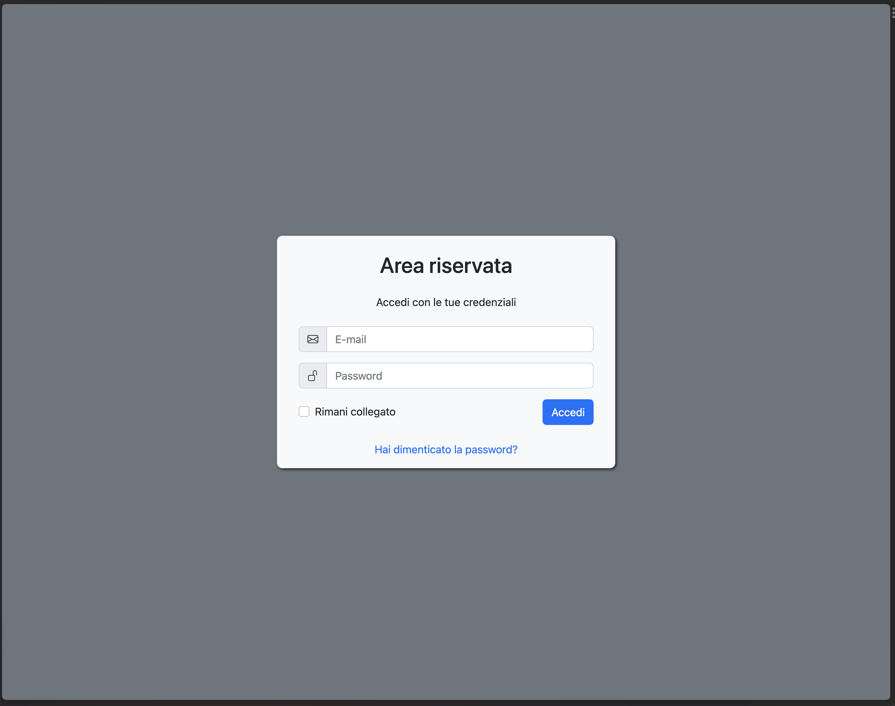
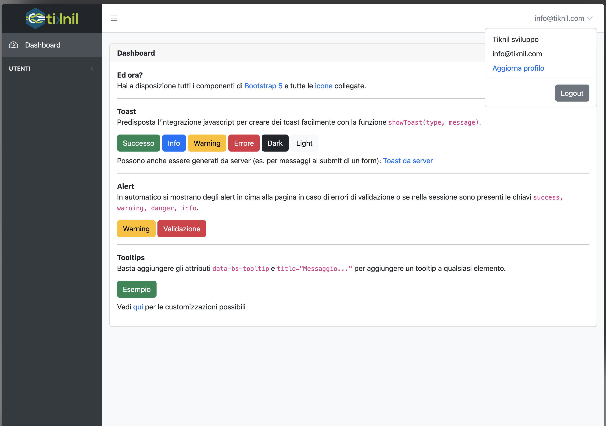
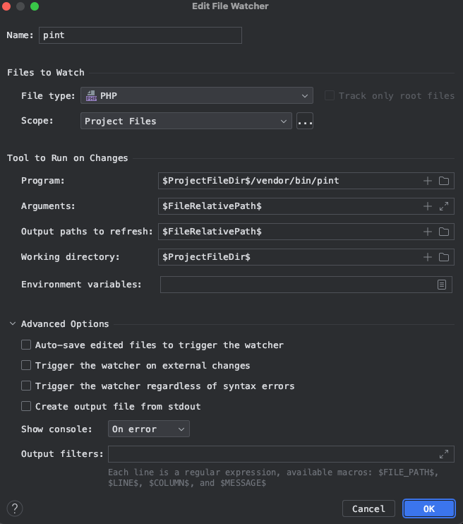
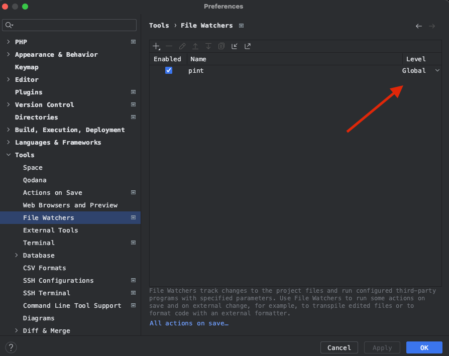
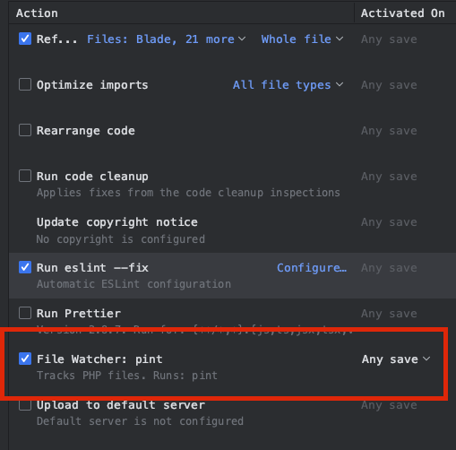
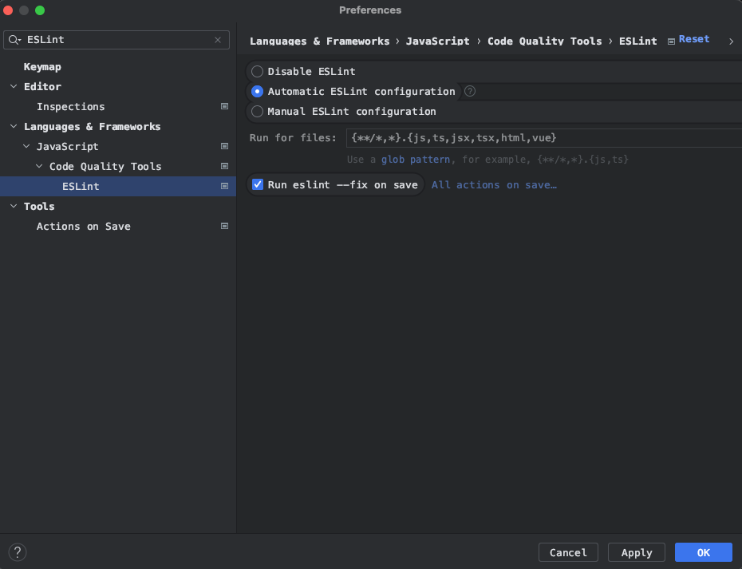
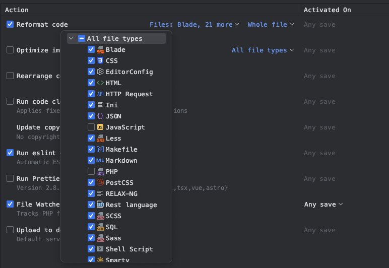

<p align="center">
<a href="https://laravel.com" target="_blank"></a>
<a href="https://www.tiknil.com" target="_blank"></a>
</p>

Progetto Laravel con la struttura, i pattern e le best practices usate in Tiknil nei progetti backend.

L'obiettivo è tenere aggiornato questo repo, da tenere come reference e documentazione per tutti i progetti Laravel

### Versioni supportate

| Laravel                               | Reference                                                   |
|---------------------------------------|-------------------------------------------------------------|
| [v10](https://laravel.com/docs/10.x/) | [master](https://github.com/tiknil/boilerplate/tree/master) |

> Il master è riferito alla versione più recente supportata. Le versioni precedenti sono taggate al commit relativo

## Utilizzo

Cambia `[laravel-project]` con il nome del nuovo progetto:

```bash
# Clona questo repo nella cartella [laravel-project]
git clone git@github.com:tiknil/laravel-boilerplate.git [laravel-project] 
cd [laravel-project] 

rm -rf .git             # Rimuovi riferimenti a questo repo git
cp .env.example .env    # File .env iniziale (da personalizzare)

# Crea un nuovo repo git e crea il primo commit. Necessario per inizializzare skipper
git init                
git add .
git commit -m "Inizializzato progetto da boilerplate"

skipper init
skipper sail
....

skipper composer install
skipper artisan key:generate
skipper artisan migrate
skipper artisan db:seed # Crea utente info@tiknil.com con password 'password'

yarn install
yarn build      # Build iniziale per generare il manifest di vite
```

> Si suppone l'utilizzo di [skipper](https://github.com/tiknil/skipper) per l'avvio del progetto in locale

# Features

- [Flusso di auth](#flusso-di-auth)
- [Backend di amministrazione](#backend-di-amministrazione)
- Predisposizione APIs
    - [Gestione degli errori](#gestione-degli-errori-json)
    - [Autenticazione tramite token](#autenticazione-tramite-token)
    - [Documentazione](#documentazione-api)
- [Dipendenze utili](#dipendenze-utili) (bugsnag, backup, telescope...)
- [Formattazione codice](#formattazione-codice)

## Flusso di auth

Viene utilizzato [Laravel Fortify](https://laravel.com/docs/fortify). Supporta login, logout e flusso di reset della
password.

- Il grosso della configurazione avviene nel file `FortifyServiceProvider`
- Interfaccia basata su bootstrap, vedi view e file scss relativo
- L'email di reset password è definita in `App/Notifications/ResetPassword`

> Manca la registrazione, dato che storicamente nei nostri progetti spesso manca o va fortemente personalizzata

<p align="center">
<a href="docs/boilerplate/login.png" target="_blank"></a>
</p>

## Backend di amministrazione

Tutto basato su [Bootstrap 5](https://getbootstrap.com/docs/5.3/getting-started/introduction/) con dei componenti custom
per header e sidebar. Vengono importate in automatico anche le [Bootstrap Icons](https://icons.getbootstrap.com/)

- Stile / colori di header e sidebar nei file scss relativi, modificando i valori delle variabili css ad inizio file
- Nel file typescript si possono inizializzare i componenti bootstrap necessari. Di default vengono attivati i
  [tooltips](https://getbootstrap.com/docs/5.3/components/tooltips/) su tutti i componenti con
  l'attributo `data-bs-tooltip`

<p align="center">
<a href="docs/boilerplate/backend.png" target="_blank"></a>
</p>

## Predisposizione APIs

#### Gestione degli errori JSON

- L'enumerativo `ApiError` definisce i possibili codici di errore
- La classe `ErrorResponse` permette di costruire la risposta JSON da restituire in caso di errore
- Nel file `app/Exceptions/Handler` vengono gestiti nel formato più comune gli errori più tipici invocati da laravel (
  es. 404, autenticazione, ecc)
- Il file `ApiController` andrebbe esteso da tutti i controller delle APIs per poter usare il
  metodo `validateApiRequest` e validare gli input come sul web senza preoccuparsi di gestire gli errori

#### Autenticazione tramite token

Di base viene predisposta l'autenticazione degli utenti tramite [Sanctum](https://laravel.com/docs/sanctum) con token
di accesso e refresh token. Vedi il `TokensController` per i dettagli

#### Documentazione API

In `docs/api.yaml` è impostata la documentazione OpenApi 3.0 degli endpoint esistenti. Con il comando

```bash
yarn docs:api
```

Tramite [Redocly CLI](https://redocly.com/docs/cli/) si va a creare il file HTML relativo, accessibile al
path `/docs/api.html`

## Dipendenze utili

Sono installate alcune dipendenze utili, in particolare:

- Livewire + [wire-table](https://github.com/tiknil/wire-table)
- Bugsnag: basta impostare `BUGSNAG_API_KEY` nell'env. Di default gli errori vengono riportati solo se l'env
  è `production`
- [Backup](https://spatie.be/docs/laravel-backup/v8/introduction): Tutto predisposto per fare backup su s3
- [Telescope](https://laravel.com/docs/telescope) per il debugging. Basta impostare `TELESCOPE_ENABLED=true` nell'env è
  recarsi all'endpoint `/telescope`. Viene installato solo in locale
- [Laravel Ide Helper](https://github.com/barryvdh/laravel-ide-helper).
  Runnare `skipper artisan ide-helper:models --write`

> 💬 --write scrive tutta la definizione come PHPDoc nel file stesso del modello. In precedenza usavamo --nowrite, che va
> a creare un file aggiuntivo _ide_helper_models.php. Con il file aggiuntivo PHPStorm mostra vari warning a causa della
> doppia reference alle classi, quindi negli ultimi progetti tendo a usare --write e tenere collassato il blocco di
> PHPDoc sopra ai modelli. Bo, non sono ancora soddisfatto al 100% di nessuna delle due opzioni ma forse mi sto trovando
> meglio con --write.

## Formattazione codice

Questo boilerplate predisponde i tool per la formattazione del codice sia PHP (tramite Pint) che JS/TS (tramite ESLint +
Prettier).

Serve comunque configurare PHPStorm per utilizzare questi tool in automatico al salvataggio di un file.

#### Pint

[Fonte](https://gilbitron.me/blog/running-laravel-pint-in-phpstorm)

`Preferences (⌘,) > Tools > Actions on save`

Aggiungere un nuovo file watcher di nome pint con questi parametri:

- Program: `$ProjectFileDir$/vendor/bin/pint`
- Arguments: `$FileRelativePath$`
- Output paths to refresh: `$FileRelativePath$`
- Working directory: `$ProjectFileDir$`

Nelle opzioni avanzate assicurarsi che tutti i flag siano disattivati.

Dopo aver creare il file watcher lo si può rendere `global`, per evitare di doverlo ricreare in ogni progetto

<p align="center">
<a href="docs/boilerplate/phpstorm_pint_watcher.png" target="_blank"></a>
<a href="docs/boilerplate/phpstorm_watchers.png" target="_blank"></a>
<a href="docs/boilerplate/phpstorm_actions.png" target="_blank"></a>
</p>

#### ESLint

`Preferences (⌘,) > Languages & Frameworks > Languages > Code Quality Tools > ESlint`

Abitare la configurazione automatica e l'esecuzione di `eslint --fix` ad ogni salvataggio

<p align="center">
<a href="docs/boilerplate/phpstorm_eslint.png" target="_blank"></a>
</p>

#### Altri file

PHPStorm supporta in automatico anche il refactoring dei file di ogni altro tipo (blade, json, yaml).
Utile per sistemare in automatico identazioni e spazi.

`Preferences (⌘,) > Tools > Actions on save`

Abilitare `Reformat code` selezionando i linguaggi desiderati. Escludere `PHP`, `Javascript` e `Typescript` per evitare
conflitti con pint ed ESLint

<p align="center">
<a href="docs/boilerplate/phpstorm_reformat.png" target="_blank"></a>
</p>
