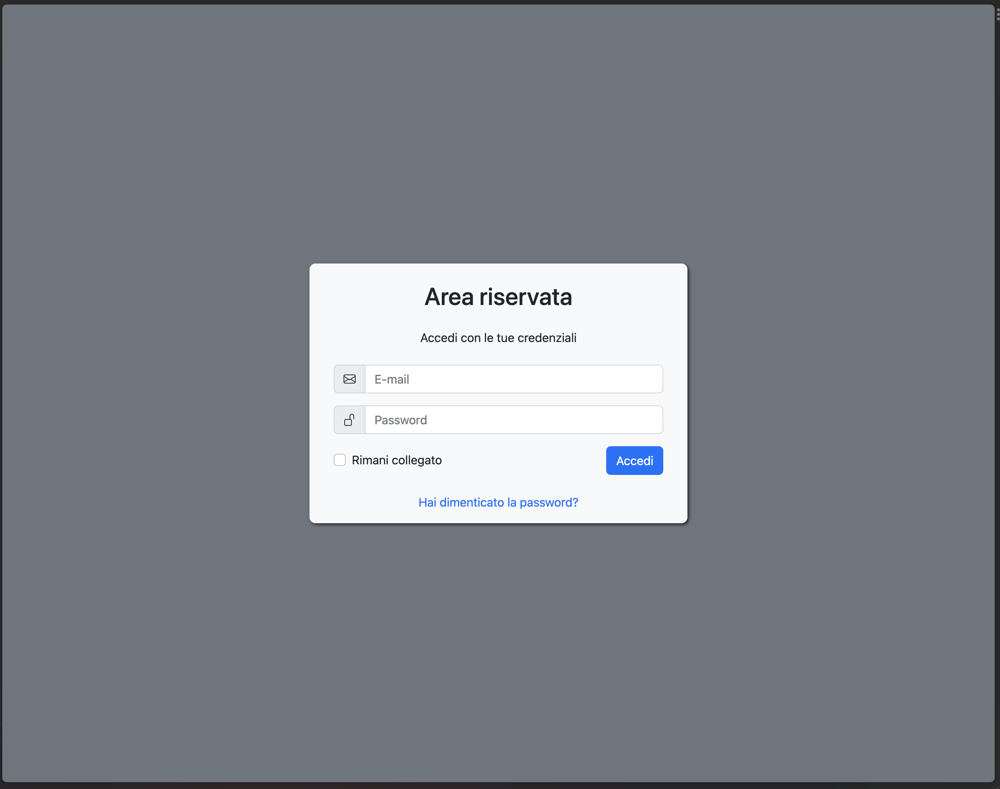

[Torna all'indice](README.md)

----

Il flusso di login e il reset della password sono inclusi.

> ⚠️ La registrazione non è implementata perché storicamente nei nostri progetti è sempre disabilitata (gli utenti
> vengono creati solo dai manager) o richiede customizzazioni particolari.

### Funzionamento

Il funzionamento è basato su [Laravel Fortify](https://laravel.com/docs/10.x/fortify),
vedi il file `app/Providers/FortifyServiceProvider.php` per le possibili configurazioni.

### Interfaccia

La UI è molto scarna e basata su Bootstrap 5.3.

- Il layout di base è definito in `resources/views/auth/page.blade.php`
- Lo stile della pagina è definito in `resources/css/auth/main.scss`
- La mail di notifica per il reset della password è definita in `App\Notifications\ResetPassword`

----

[Torna all'indice](README.md)
