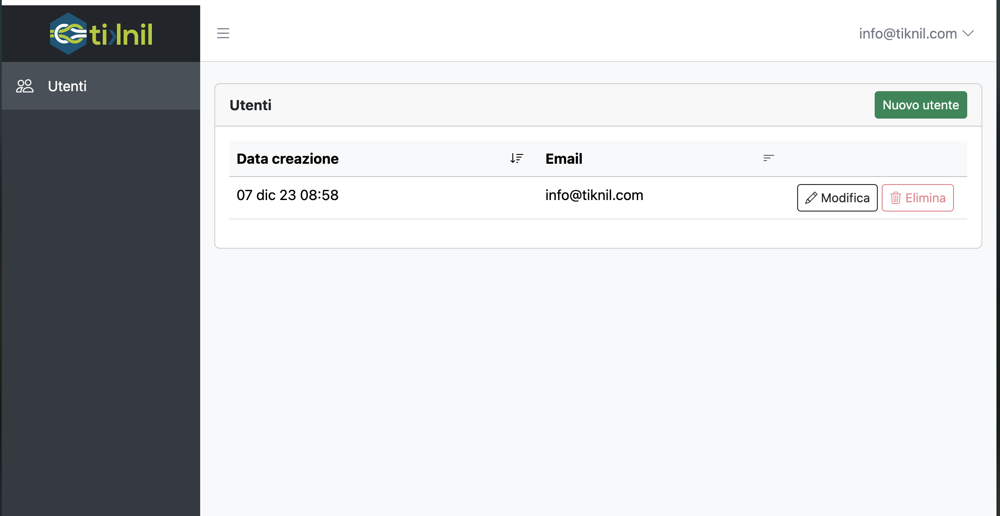

[Torna all'indice](README.md)

----

<p align="center">
<a href="images/backend.png" target="_blank"></a>
</p>

### Organizzazione codice

I controllers, le view e i file js/css relativi al backend sono raggruppati sotto la cartella `backend` (
quindi `app/Http/Controllers/Backend/...`, `resources/views/backend/...` ecc).

Le route sono definite nel file `web.php`, dentro all'apposito gruppo che definisce sia la richiesta di autenticazione
che il prefisso `/backend` su tutti gli URL.

### Interfaccia

La UI è basata su Bootstrap 5.3, si possono quindi usare senza problemi tutte le utility e tutti i componenti messi a
disposizione.

[📚 Documentazione Bootstrap](https://getbootstrap.com/docs/5.3)

Insieme a bootstrap sono importate di base anche il suo set di icone.

Per inserire un'icona:

- Selezionarla dal [catalogo](https://icons.getbootstrap.com/)
- Inserire il tag `<i class="bi bi-${NOME}"></i>` dove necessario, es. `<i class="bi bi-people"></i>`
- Dimensione e colore sono equivalenti a quelle di un semplice testo, quindi impostabili con `font-size` e `color`

#### Toasts

In particolare, i [Toast](https://getbootstrap.com/docs/5.3) di bootstrap sono predisposti e pronti all'uso per mostrare
messaggi di successo, warning o errore all'utente.

Le tipologie di toast supportate sono: `'error', 'danger', 'info', 'warning', 'success', 'dark', 'light'`

**Lato server**, si possono creare con la classe `App/Utils/Toast`:

```php
Toast::show("success", "Messaggio!")
```

Il messaggio verrà mostrato all'utente alla *successiva* pagina visualizzata.

**Lato client**, si possono creare tramite javascript tramite la funzione `showToast`:

```js
showToast('error', 'Si è verificato un errore')
```

NB i toast funzionano automaticamente anche tra aggiornamenti di componenti Livewire

#### Forms

La libreria [bs-blade-forms](https://github.com/tiknil/wire-table) è inclusa e pronta all'uso, vedi il form di modifica
utente per un esempio

#### Wire Table

La libreria [Wire Table](https://github.com/tiknil/wire-table) è inclusa e pronta all'uso in
tutte le schermate.

Vedi `app/Http/Livewire/UsersTable.php` per un esempio base.

> Livewire viene incluso di default insieme a wire-table, quindi si possono direttamente creare ed utilizzare componenti
> livewire senza ulteriore setup necessario.

#### Vue 3

Vue 3 è configurato e pronto all'uso, si possono creare i componenti richiesti e inizializzare vue
con `createApp` nelle pagine dove serve.

Vedi `resources/js/vue/Counter` per un esempio di componente.


----

[Torna all'indice](README.md)
