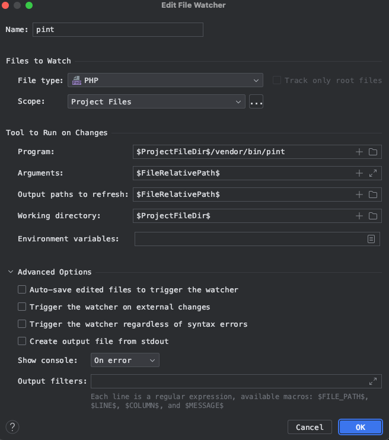
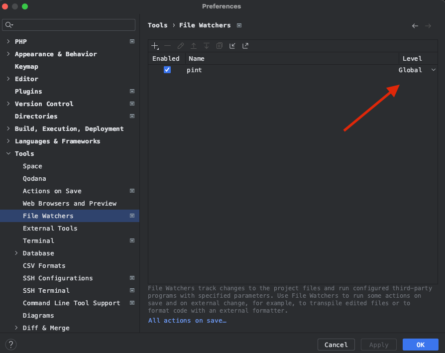
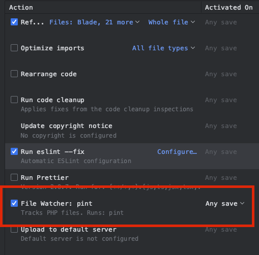
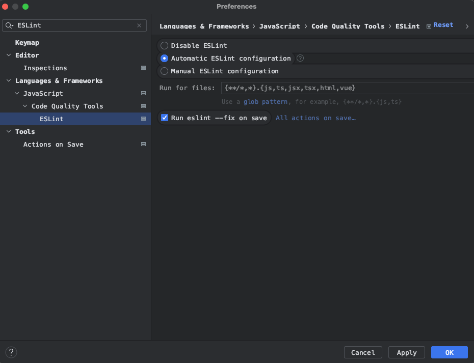
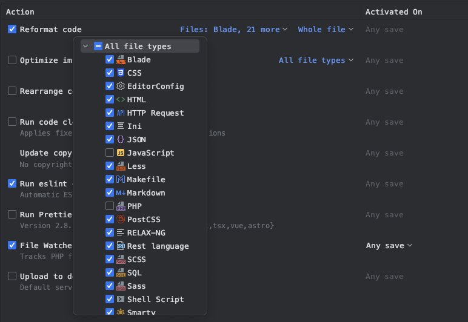

[Torna all'indice](README.md)

--- 

## Flag cartelle

Per ottimizzare gli autocompletamenti e la ricerca, conviene segnalare PHPStorm la tipologia di alcune cartelle.

> Si può cambiare la *tipologia* di una cartella con tasto destro > Mark directory as

- `app/` => Sources Root
- `public/` => Resource Root
- `bootstrap/cache` => Excluded
- `public/build` => Excluded
- `public/docs` => Excluded
- `public/vendor` => Excluded
- `storage/logs` => Excluded
- `storage/framework` => Excluded

## Formattazione codice

Vengono predisposti i tool per la formattazione del codice PHP (tramite [Pint](https://laravel.com/docs/10.x/pint)) e
JS/TS (tramite ESLint +
Prettier).

Serve comunque configurare PHPStorm per utilizzare questi tool in automatico al salvataggio di un file.

#### Pint

[Fonte](https://gilbitron.me/blog/running-laravel-pint-in-phpstorm)

`Preferences (⌘,) > Tools > Actions on save`

Aggiungere un nuovo file watcher di nome pint con questi parametri:

- Program: `$ProjectFileDir$/vendor/bin/pint`
- Arguments: `$FileRelativePath$`
- Output paths to refresh: `$FileRelativePath$`
- Working directory: `$ProjectFileDir$`

Nelle opzioni avanzate assicurarsi che tutti i flag siano disattivati.

Dopo aver creare il file watcher lo si può rendere `global`, per evitare di doverlo ricreare in ogni progetto

#### ESLint

`Preferences (⌘,) > Languages & Frameworks > Languages > Code Quality Tools > ESlint`

Abitare la configurazione automatica e l'esecuzione di `eslint --fix` ad ogni salvataggio

#### Altri file

PHPStorm supporta in automatico anche il refactoring dei file di ogni altro tipo (blade, json, yaml).
Utile per sistemare in automatico identazioni e spazi.

`Preferences (⌘,) > Tools > Actions on save`

Abilitare `Reformat code` selezionando i linguaggi desiderati. Escludere `PHP`, `Javascript` e `Typescript` per evitare
conflitti con pint ed ESLint

----

[Torna all'indice](README.md)
